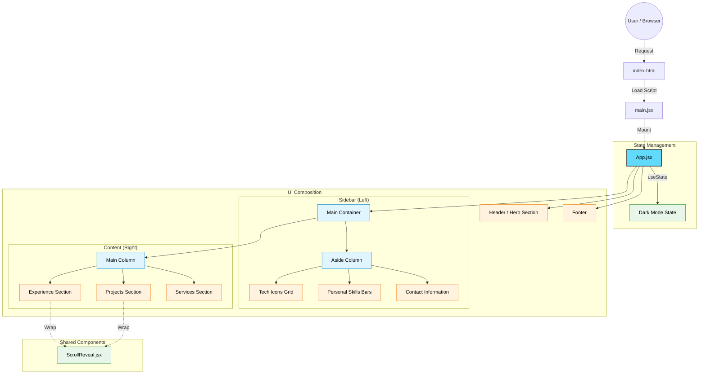

# 📄 Piyush Sharma - Digital Resume

A professional, interactive, and responsive digital resume application built with Modern Web Technologies. This project serves as a dynamic portfolio showcasing skills, experience, and projects with a printable layout.


## ✨ Features

- **Responsive Design**: Adapts seamlessly to all screen sizes.
- **Dark Mode**: Built-in theme toggler for light and dark visual preferences.
- **Print Friendly**: Optimized CSS for printing the resume directly from the browser.
- **Scroll Animations**: Smooth reveal animations for a premium user experience.
- **Dynamic Content**: Data-driven components for easy updates.

## 🛠️ Tech Stack

- **Core**: [React](https://react.dev/) (v19)
- **Build Tool**: [Vite](https://vitejs.dev/)
- **Styling**: Modern CSS3, TailwindCSS
- **Animations**: Custom ScrollReveal using Intersection Observer API

## 🚀 Getting Started

Follow these instructions to run the project locally.

### Prerequisites

- Node.js (v18 or higher)
- npm or yarn

### Installation

1. **Clone the repository**
   ```bash
   git clone <repository-url>
   cd piyush-resume
   ```

2. **Install dependencies**
   ```bash
   npm install
   ```

3. **Run the development server**
   ```bash
   npm run dev
   ```

4. **Build for production**
   ```bash
   npm run build
   ```

## 🏗️ Architecture & Flow

The application follows a streamlined component-based architecture. Below is the flow of data and structure of the application.

### Component Flow Diagram



## 📂 Project Structure

```bash
piyush-resume/
├── public/              # Static assets (images, icons)
├── src/
│   ├── components/
│   │   └── ScrollReveal.jsx  # Animation wrapper component
│   ├── App.css          # Main styling and theme variables
│   ├── App.jsx          # Root component containing all resume sections
│   ├── index.css        # Global CSS resets
│   └── main.jsx         # React application entry point
├── index.html           # HTML template
├── package.json         # Project manifests and scripts
└── vite.config.js       # Tooling configuration
```

## 🎨 UI Elements Breakdown

- **Theme Toggle**: Switch between Light/Dark modes.
- **Skill Meters**: Visual representation of proficiency levels.
- **Timeline Cards**: For Experience and Projects (wrapped in animation).
- **Contact Action**: Print button and clickable contact links.

---
© 2024 Piyush Sharma
